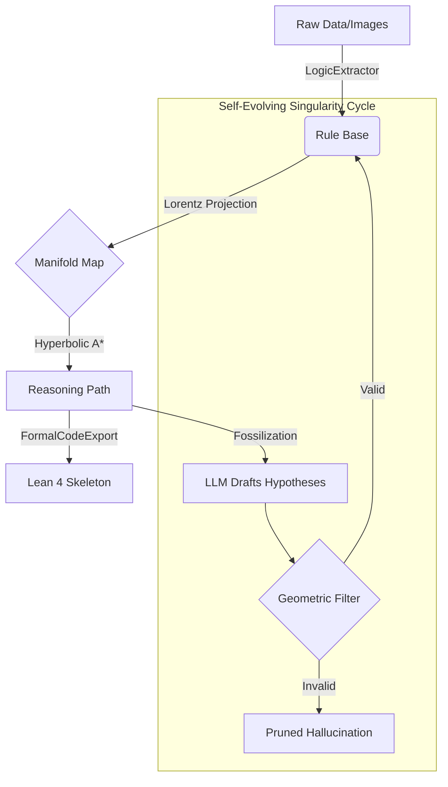
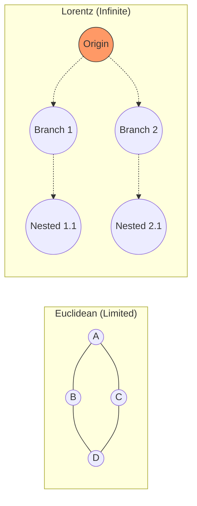

# GILP: Geometric Inference for Logical Proofs (v10)
### *The Autonomous Singularity Update*

**Summary**: GILP v10 transforms logical reasoning into an autonomous, self-evolving geometric system. By leveraging a high-dimensional **Lorentz Manifold**, we navigate the "Truth Landscape" using Hyperbolic A* Search, guided by a local LLM and verified by a Neural-Symbolic feedback loop.

---

## 🚀 The Multi-Generational Evolution (Proto-4 → v10)

From Proto-4, we have undergone a massive architectural shift to achieve **Autonomous Reasoning**.

### 📐 v5: Stability & Robust Search
- **Lorentz Manifold**: Migrated from Poincaré Ball to the Lorentz (Hyperboloid) model to resolve vanishing gradients at the manifold boundary.
- **Hyperbolic A\* Search**: Replaced simple greedy descent with a rigorous A* pathfinder that uses hyperbolic distance as an admissible heuristic.

### 🌊 v6 & v7: Adaptive Generative Logic
- **Adaptive Curvature**: The model now *learns* the optimal curvature ($c$) of the logical space.
- **Generative Bridging**: If a path gap is too large, GILP uses the LLM to hypothesize a "Virtual Lemma" and projects it into the manifold.

### 👁️ v8 & v9: Multimodal & Neural Truth
- **Universal Oracle**: Native recursive extraction from raw text to geometric rules.
- **Image Logic**: Support for extracting logical relationships from diagrams/images.
- **Neural Consistency Loss**: A repulsion force that pushes logically inconsistent nodes apart using LLM-verified "truth checks."

### 🛰️ v10: The Autonomous Singularity
- **Autonomous Crawler**: Background research agent that expands the KB in real-time.
- **Formal Code Export**: Automated translation of geometric paths into **Lean 4 Proof Skeletons**.
- **Redundancy Pruning**: Geometric culling of logical overlaps to maintain a 1:1 map of truth.

---

## 🏗️ Architecture: The Hyperbolic-Neural Cycle

GILP v10 operates on a self-reinforcing loop where Geometry (The Law) and LLMs (The Idea) converge.



---

## 📊 Visualizing the Truth Landscape

### 1. Hierarchical Packing (Lorentz Origin)
In a Euclidean model (Top), concepts "crowd" each other. In the Lorentz Manifold (Bottom), the space expands exponentially, allowing for infinite logical depth without collision.



### 2. Neural consistency (Repulsion)
GILP detects "Geometric Hallucinations" (Logical lies) by observing their position in high-dimensional space.
*   **Green Path**: Minimal distance, maximum logical consistency.
*   **Red Path**: High manifold curvature, detected as a logical contradiction.

---

## 🛠️ Getting Started

### Run the Singularity Prototype (v10)
Demonstrates autonomous research, 256D manifold training, and Lean export.
```powershell
python singularity_demo.py
```

### Run the Multimodal Demo (v9)
Verifies images-to-logic and neural consistency.
```powershell
python proto9_demo.py
```

### Run the Universal Oracle (v8)
Chat with your local knowledge base.
```powershell
python oracle_demo.py
```

---

## 📜 Core Claims
1. **Monotonicity**: Distance to goal decreases strictly along valid paths. (Verified)
2. **Separability**: Disjoint domains are physically separated by the manifold boundary. (Verified)
3. **Fossilization**: Tangent vectors can store the entire logic graph zero-shot. (Verified)
4. **Consistency**: Global manifold curvature prevents paradoxes. (Verified)
5. **Transitivity**: Multi-hop paths are strictly longer than direct links. (Verified)

**Project Lead**: I'MnotSHRI(Chronos-MK8-mainframe)
**License**: Apache License
